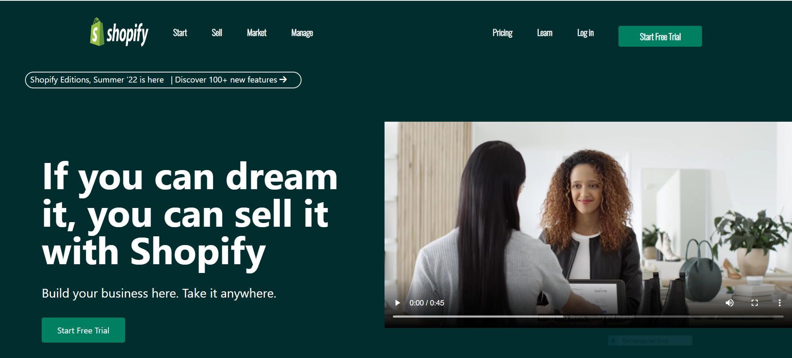
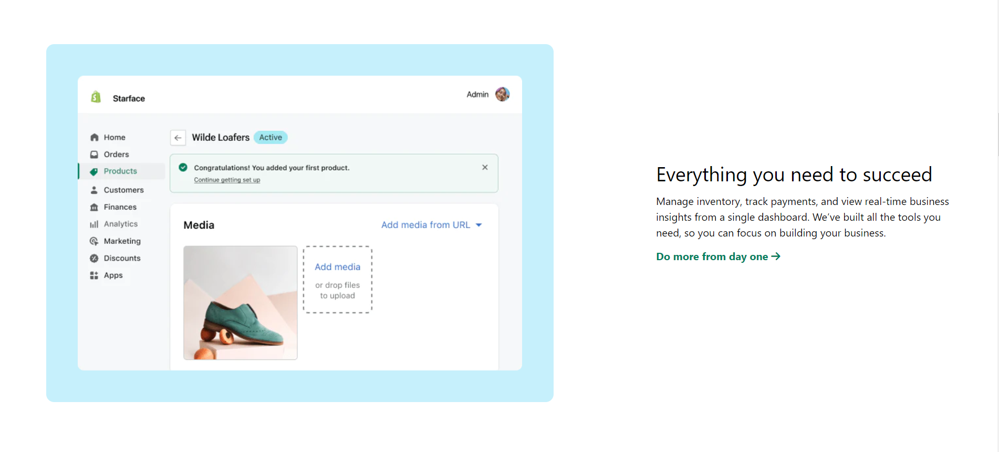
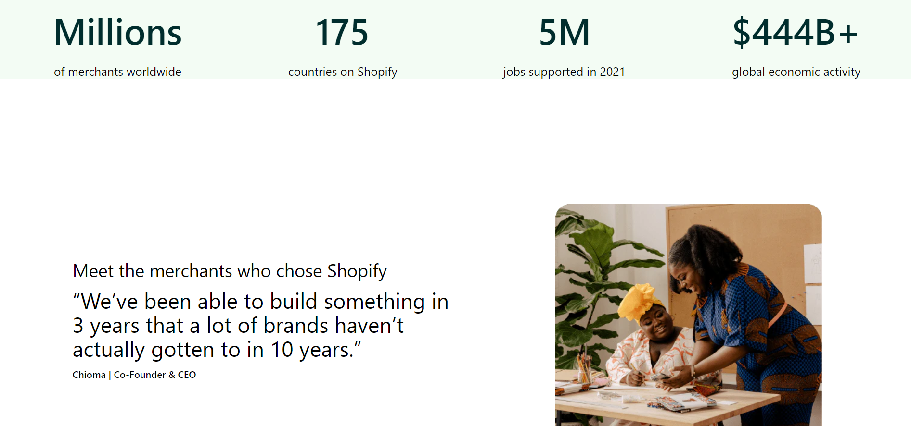
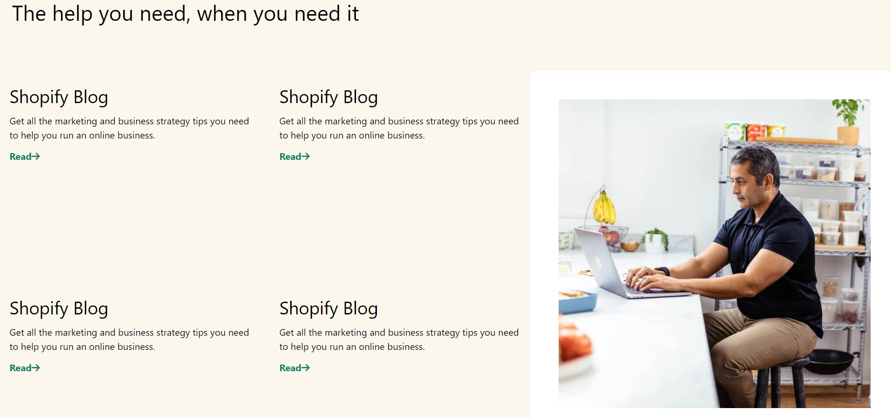
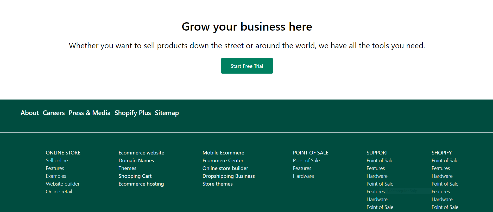

## Firstly, I'd like to thanks [Hitesh Sir](https://twitter.com/Hiteshdotcom) & the team of [iNeuron](https://ineuron.ai) for designing such a beautiful project which made me realise my potential.

## 🚀 About Me
>I'm a front-end developer...

# Hi, I'm shaQuib! 👋

## 🛠 Skills used in building this project
>HTML5 & TAILWIND CSS...
> It's my second project built using **tailwind**

## Name of the Project

 > Shopify Landing Page Clone
 
## Time taken to complete this project
> 9.5 hours

## `Learning curve`
***
- Learned many important concepts of tailwind

- How to use flex for medium and mobile devices .

 - How to align items differently for mobile devices

 - And most importantly the confidence to convert any wireframe into a beautiful web pages.

## `Final Interface`

*** 
- Below is the screen shot of how does this web app page looks like while running on the browser.

### `SITE NAME -` [Shopify Clone](https://shopify-ui-clone.netlify.app/)

